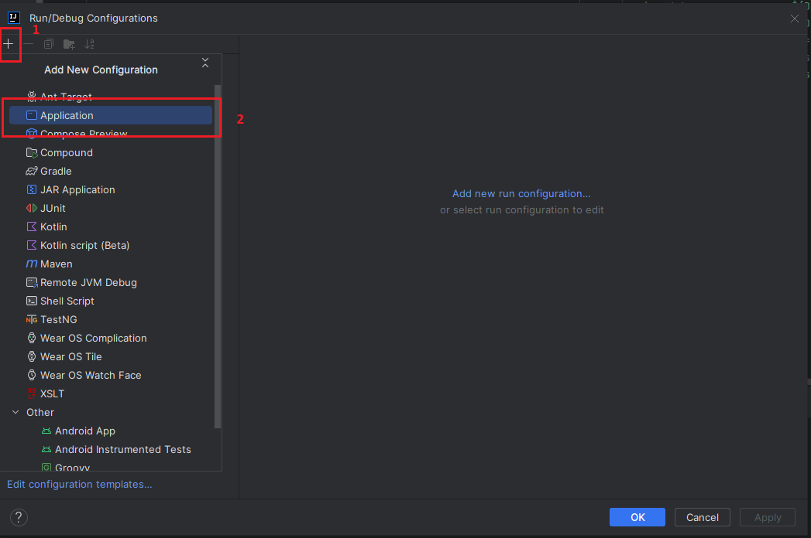

## Project folder structure

## Running the Project
To run the project:

Before you run this project, let's config environment for this project.
1. Install plugin 'EnvFile'
   
2. Add configuration
   
   
3. Setting for configuration we've just created
   
4. Go to .env.example file, rename it to .env and pass appropriate values to all variable in that file.
